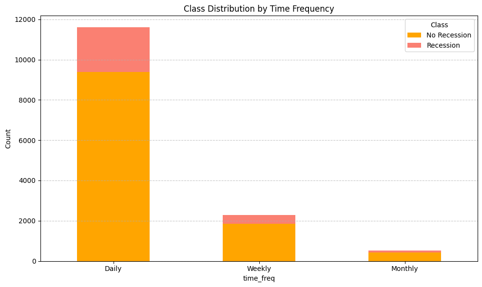

# Recession Prediction ML

> Comparing traditional machine learning and deep learning models for forecasting U.S. economic recessions using yield curve indicators.

---

## Overview

This project was built for a Machine Learning course and investigates whether macroeconomic yield curve data alone can predict economic recessions. It compares four classical ML models against five LSTM architectures across three time frequencies — **daily, weekly, and monthly** — using binary classification (Recession / No Recession).

---

## Economic Indicators

| Indicator | Description | Source |
|---|---|---|
| [**GS10**](https://fred.stlouisfed.org/series/GS10) | 10-Year Treasury Constant Maturity Rate | FRED |
| [**DGS2**](https://fred.stlouisfed.org/series/DGS2) | 2-Year Treasury Constant Maturity Rate | FRED |
| [**DGS3MO**](https://fred.stlouisfed.org/series/DGS3MO) | 3-Month Treasury Bill Rate | FRED |

Yield curve inversions (short-term rates exceeding long-term rates) are historically strong leading indicators of recessions. Recession labels are sourced from [NBER via FRED](https://fred.stlouisfed.org/series/USREC).

<p align="center">
  
</p>

---

## Class Imbalance

Recession periods represent only ~19% of the dataset across all time frequencies — a significant class imbalance addressed through SMOTE, random undersampling, class weights, and a weighting factor (α).

<p align="center">
  
</p>

---

## Models

### Classical ML
| Model | Notes |
|---|---|
| Logistic Regression | Best overall performer |
| Easy Ensemble Classifier | Strong, sensitivity-focused |
| Balanced Random Forest | Failed (AUC-ROC < 0.5) |
| XGBoost | Failed (AUC-ROC < 0.5) |

### Deep Learning (LSTM)
| Model | Architecture |
|---|---|
| LSTM_4 | 1 layer, 4 units |
| LSTM_8 | 1 layer, 8 units |
| LSTM_4_4 | 2 layers, 4 + 4 units |
| LSTM_8_4 | 2 layers, 8 + 4 units |
| LSTM_8_8 | 2 layers, 8 + 8 units |

---

## Results

**Metric:** AUC-ROC (test set). Models with AUC-ROC < 0.5 (worse than random) were excluded from further analysis for traditional models; all LSTM models were retained for comparison.

| Time Frequency | Model | AUC-ROC |
|---|---|---|
| **Daily** | **Logistic Regression** | **0.7222** |
| | Easy Ensemble Classifier | 0.6918 |
| | LSTM_4 | 0.7202 |
| | LSTM_4_4 | 0.7330 |
| | LSTM_8 | 0.2752 |
| | LSTM_8_4 | 0.7291 |
| | LSTM_8_8 | 0.7021 |
| **Weekly** | **Logistic Regression** | **0.7251** |
| | Easy Ensemble Classifier | 0.6853 |
| | LSTM_4 | 0.7178 |
| | LSTM_4_4 | 0.7263 |
| | LSTM_8 | **0.7604** ← highest overall |
| | LSTM_8_4 | 0.4078 |
| | LSTM_8_8 | 0.6019 |
| **Monthly** | **Logistic Regression** | **0.7263** |
| | Easy Ensemble Classifier | 0.6675 |
| | LSTM_4 | 0.5335 |
| | LSTM_4_4 | 0.3880 |
| | LSTM_8 | 0.3730 |
| | LSTM_8_4 | 0.5952 |
| | LSTM_8_8 | 0.4559 |

---

## Recession Probability Forecasts

### Logistic Regression & Easy Ensemble

Both models produce elevated probabilities ahead of known recession periods. Logistic Regression gives smoother, more gradual signals; Easy Ensemble produces sharper peaks (~52 weeks before a recession).

<p align="center">
  
  
</p>
<p align="center">
  
  
</p>
<p align="center">
  
  
</p>

### Single-Layer LSTMs (LSTM_4 & LSTM_8)

<p align="center">
  
  
</p>
<p align="center">
  
  
</p>

### Double-Layer LSTMs (LSTM_4_4, LSTM_8_4, LSTM_8_8)

<p align="center">
  
  
  
</p>

---

## Key Findings

- **Logistic Regression** was the most consistent performer across all time frequencies, challenging the assumption that complexity yields better results.
- **LSTM_8** achieved the single highest AUC-ROC (0.7604) on weekly data, but was inconsistent across frequencies.
- **XGBoost and Balanced Random Forest** failed to exceed the 0.5 AUC-ROC threshold and were excluded from further analysis.
- **AUC-ROC alone** may be insufficient for evaluating LSTM models — probability trajectory shape and timing matter in real-world recession forecasting.

---

## Tech Stack

| Category | Libraries |
|---|---|
| Data | `pandas`, `numpy`, FRED API |
| Classical ML | `scikit-learn`, `imbalanced-learn`, `xgboost` |
| Deep Learning | `tensorflow` / `keras` |
| Visualization | `matplotlib` |

---

## Project Structure

```
├── Notebooks/
│   ├── data_prep.ipynb          # Data collection and preprocessing
│   ├── Trad_Models4.ipynb       # Classical ML models
│   ├── LSTM_Models1.ipynb       # LSTM models
│   └── Submission.ipynb         # Final submission notebook
├── Notebooks/Dataset/           # Processed datasets (daily/weekly/monthly)
├── Report/
│   └── Final/
│       ├── main.pdf             # Full project report
│       └── Steps/Plots/         # All generated charts
├── Utils/
│   ├── functions.py             # Shared model utilities
│   └── file_io.py               # I/O helpers
├── Dataset/
│   └── get_data.py              # FRED data fetching script
├── requirements1.txt            # Core dependencies
└── requirements2.txt            # Extended dependencies
```

---

## Setup

```bash
pip install -r requirements1.txt
# or for full dependencies:
pip install -r requirements2.txt
```

Run notebooks in order: `data_prep` → `Trad_Models4` / `LSTM_Models1` → `Submission`.

---

## Report

Full methodology, model analysis, and findings: [`Report/Final/main.pdf`](./Report/Final/main.pdf)
